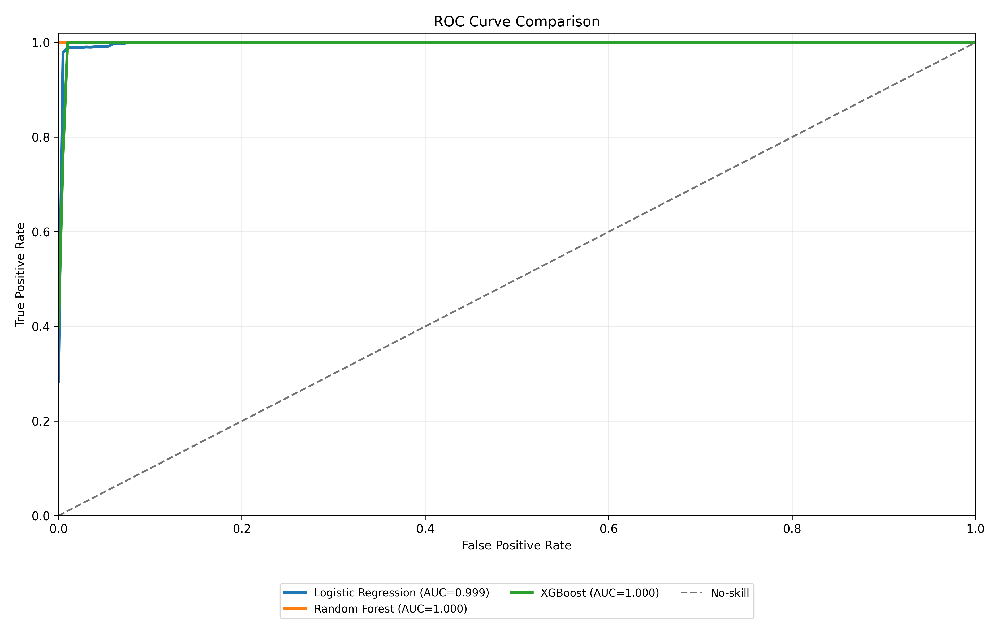
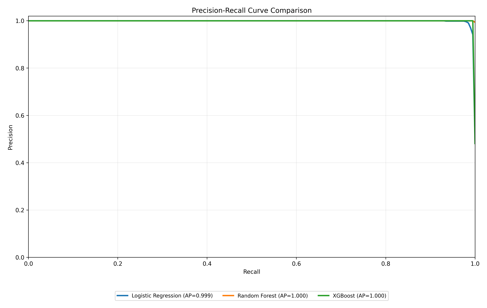
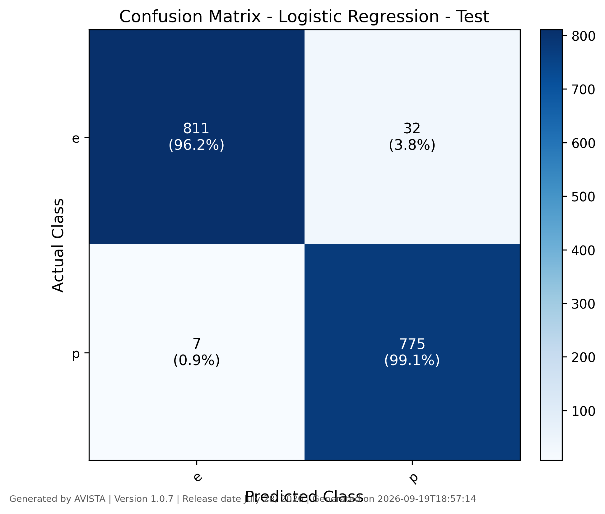
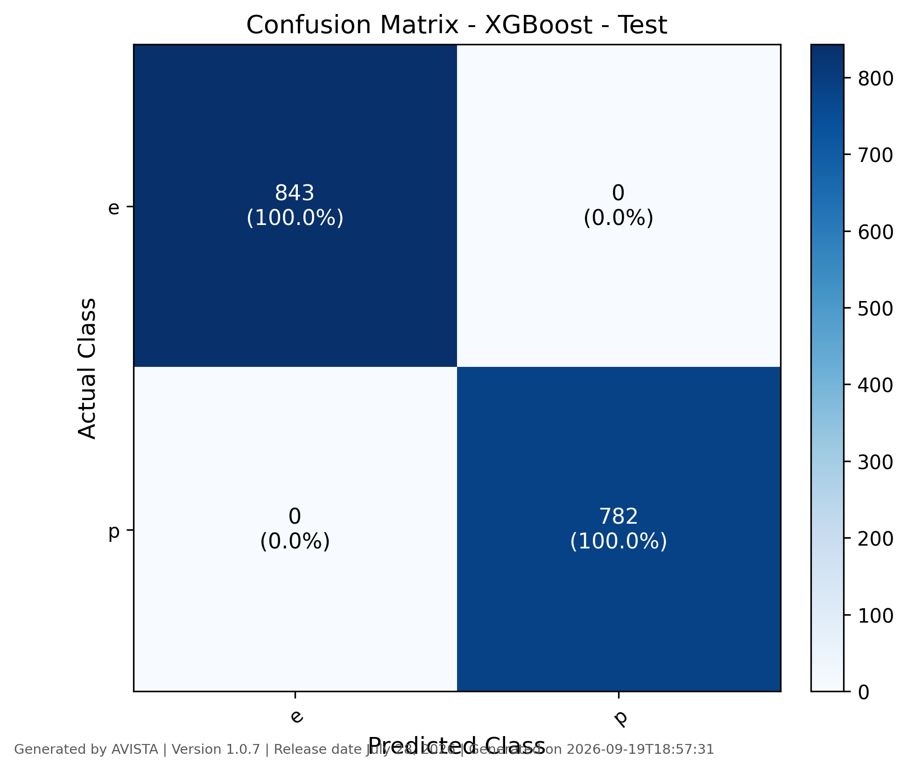
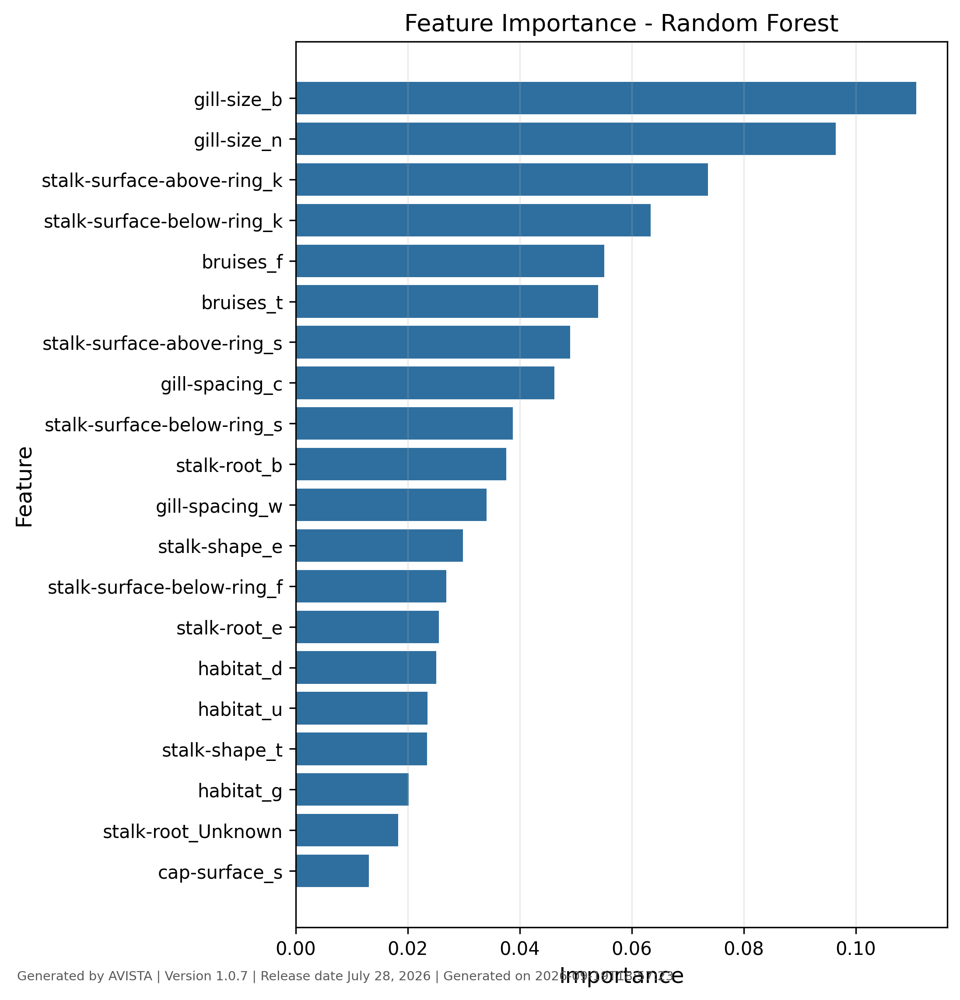

# AVISTA Model Report

An extensible desktop platform for tabular machine learning and deep learning analytics.

## Project Summary

- Project name: mushroom
- Target column: poisonous
- Report generated: 2026-09-19T18:58:07
- AVISTA version: 1.0.7
- AVISTA release date: July 28, 2026

## Dataset Summary

- Dataset rows: 8124
- Feature count: 13
- Train rows: 5686
- Validation rows: 813
- Test rows: 1625

## Modeling Configuration

- Selected models: logistic_regression, random_forest, xgboost
- Cross-validation: Enabled
- CV folds: 5

## Split and Imbalance Summary

- Split method: random
- Imbalance method: smote
- Numerical scaling: standard
- Validation role: deep-model early stopping and checkpoint selection
- Test role: held-out final evaluation after fitting and checkpoint selection
- CV role: outer validation folds are used only for fold scoring

## Model Performance Summary

Unless otherwise stated, model comparison figures and diagnostic tables are based on the test set.

| Model | Status | Train Accuracy | Train Macro-F1 | Validation Accuracy | Validation Macro-F1 | Test Accuracy | Test Macro-F1 | CV Accuracy Mean | CV Accuracy Std | CV Macro-F1 Mean | CV Macro-F1 Std | ROC-AUC | Saved |
| --- | --- | --- | --- | --- | --- | --- | --- | --- | --- | --- | --- | --- | --- |
| Logistic Regression | trained | 0.9851 | 0.9850 | 0.9865 | 0.9864 | 0.9760 | 0.9760 | 0.9828 | 0.0036 | 0.9828 | 0.0036 | 0.9993 | Yes |
| Random Forest | trained | 1.0000 | 1.0000 | 1.0000 | 1.0000 | 1.0000 | 1.0000 | 1.0000 | 0.0000 | 1.0000 | 0.0000 | 1.0000 | Yes |
| XGBoost | trained | 1.0000 | 1.0000 | 1.0000 | 1.0000 | 1.0000 | 1.0000 | 1.0000 | 0.0000 | 1.0000 | 0.0000 | 1.0000 | Yes |

## ROC Curve Comparison

## Precision-Recall Curve Comparison

## Deep Learning Training Curves

Not available

## Confusion Matrices

### Logistic Regression

### Random Forest

### XGBoost

## Classification Reports

### Logistic Regression - Test

| Class | precision | recall | f1-score | support |
| --- | --- | --- | --- | --- |
| e | 0.9914 | 0.9620 | 0.9765 | 843.0000 |
| p | 0.9603 | 0.9910 | 0.9755 | 782.0000 |
| accuracy | 0.9760 | 0.9760 | 0.9760 | 0.9760 |
| macro avg | 0.9759 | 0.9765 | 0.9760 | 1625.0000 |
| weighted avg | 0.9765 | 0.9760 | 0.9760 | 1625.0000 |

### Random Forest - Test

| Class | precision | recall | f1-score | support |
| --- | --- | --- | --- | --- |
| e | 1.0000 | 1.0000 | 1.0000 | 843.0000 |
| p | 1.0000 | 1.0000 | 1.0000 | 782.0000 |
| accuracy | 1.0000 | 1.0000 | 1.0000 | 1.0000 |
| macro avg | 1.0000 | 1.0000 | 1.0000 | 1625.0000 |
| weighted avg | 1.0000 | 1.0000 | 1.0000 | 1625.0000 |

### XGBoost - Test

| Class | precision | recall | f1-score | support |
| --- | --- | --- | --- | --- |
| e | 1.0000 | 1.0000 | 1.0000 | 843.0000 |
| p | 1.0000 | 1.0000 | 1.0000 | 782.0000 |
| accuracy | 1.0000 | 1.0000 | 1.0000 | 1.0000 |
| macro avg | 1.0000 | 1.0000 | 1.0000 | 1625.0000 |
| weighted avg | 1.0000 | 1.0000 | 1.0000 | 1625.0000 |

## Feature Importance

### Random Forest

## Output Files

- model_performance_summary.csv
- roc_curve_comparison.png
- pr_curve_comparison.png
- model_performance_summary.csv
- AVISTA_Report.md
- AVISTA_Report.pdf

## Reproducibility Metadata

- Project file: D:\TXST\OneDrive - Texas State University\Hackathon_Monzurul\Papers\AVISTA\examples\mushroom\mushroom.avista
- Random state: 42
- Target column: poisonous

---

Generated by AVISTA
Version 1.0.7
Generated on 2026-09-19T18:58:07
